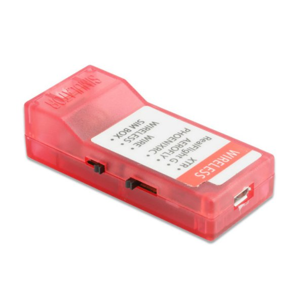
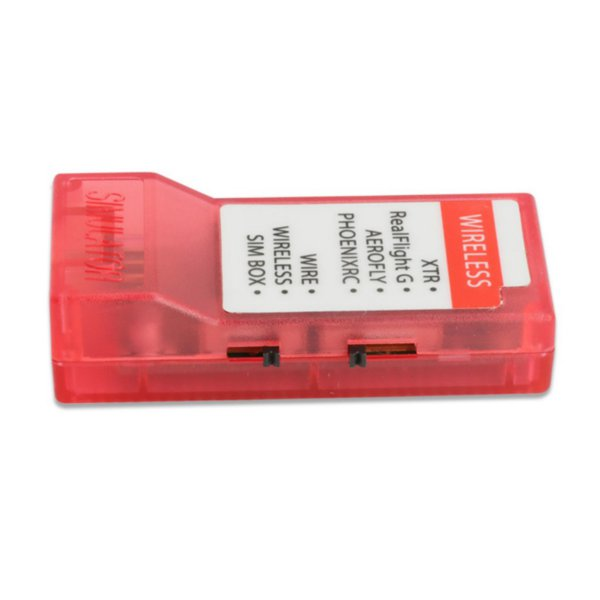

# SAILI reader

Read the raw control packets produced by a FeiYing/SAILI PhoenixRC USB
simulator adapter (`1781:0898`) on macOS.

The adapter emits eight-byte packets containing seven analogue values and one
digital switch value. The Rust application provides a live terminal UI, while
`read_saili.py` remains available as a lightweight diagnostic reader.




## Wire the Turnigy TGY 9X

For a wired connection, use the 3.5 mm audio lead supplied with the SAILI
adapter. You do not need the three receiver/servo leads.

```text
TGY 9X trainer jack ── 3.5 mm audio lead ── SAILI 3.5 mm socket
Mac USB port        ── SAILI USB cable   ── SAILI USB socket
```

1. Disconnect power from every aircraft and receiver that is bound to the
   transmitter. Remove propellers if a nearby model could possibly become
   powered.
2. On the TGY 9X, select or create a simple simulator model. Disable mixes and
   set the modulation/output mode to **PPM**, not PCM.
3. Turn the TGY 9X power switch **off**.
4. Connect the 3.5 mm lead between the trainer jack on the back of the TGY 9X
   and the 3.5 mm socket on the SAILI adapter.
5. Leave the transmitter's main power switch **off**. On an unmodified stock
   TGY 9X, inserting the trainer lead powers the transmitter logic in simulator
   mode without powering the RF module. Its display should come on.
6. Set the SAILI simulator selector to **Phoenix/PhoenixRC** and its input
   selector to **WIRE**. **SIM BOX** does not work for this direct trainer-cable
   setup. The working selector combination makes macOS identify the adapter as
   `SAILI Simulator - PhoenixRC Controller` with USB ID `1781:0898`.
7. Connect the SAILI adapter to the Mac over USB.

The TGY 9X exposes PPM through its phone-style trainer jack, and the SAILI
adapter accepts the supplied standard 3.5 mm lead. If you ever make a cable
instead of using the supplied one, the trainer-port signal is on the **tip**,
ground is on the **sleeve**, and no power connection is required. Do not feed
voltage into the trainer jack.

### Stock RF-module caveat

The TGY 9X used with this project does not produce usable trainer-port PPM
while its stock RF module is connected. With the module connected, the adapter
still emits HID reports, but the controls remain fixed near their centre
values. Disconnecting the RF module makes the controls work and confirms the
known stock trainer-port loading fault.

The stock module on this transmitter is tethered by its antenna wire. Do
**not** use the transmitter with the module pulled out or leave the module
hanging from that wire. Removing it is only a diagnostic test performed with
USB, the trainer lead, and transmitter power disconnected first.

Reliable simulator use with the RF module installed requires the documented
TGY 9X trainer-port hardware modification. The established repair cuts the
relevant PCB trace and installs a series resistor, but the board revision and
modification points must be verified before opening or soldering the
transmitter. Remove the transmitter battery before any internal work. See the
[Turnigy 9X trainer-port investigation and repair](https://www.desert-wolfe.com/Projects/Turnigy/default.html)
for the circuit measurements and modification.

The transmitter's `TRAINER` menu configures the 9X as the instructor in a
two-radio setup. It is not required when using the transmitter's PPM output
with this simulator adapter.

## Rust TUI

Install Rust if it is not already available:

```bash
brew install rust
```

The TUI reads the USB controller and sends its mapped RC state directly to the
ESPHome native API action. Use the same base64 key configured as
`api_encryption_key` in `esphome/secrets.yaml`:

```bash
export SAILI_ESPHOME_KEY='paste-the-base64-api-key-here'
cargo run --release
```

It connects to `madflight-rc-bridge.local:6053` by default. Override the
address when mDNS is unavailable:

```bash
cargo run --release -- --esphome-address 192.0.2.10:6053
```

The interface shows all seven raw inputs, the mapped roll, pitch, throttle,
yaw, and arm states, ESPHome connection state, command counts, round-trip
time, whether the bridge is receiving live or safe values, and decoded
telemetry returned by the flight controller. The telemetry panel retains the
latest battery, attitude, GPS, flight-mode, vario, barometer, and magnetometer
values along with the most recent raw CRSF frame.

Output starts in **SAFE HOLD**. With the controller reporting fresh input,
throttle low, and the arm switch off, press `l` to enable live forwarding.
Press `l` again to return to safe hold. Press `q`, Escape, or Control-C to send
safe values and exit.

The default primary mapping is raw channels 1-4 to AETR. The adapter's digital
switch controls CRSF channel 5 (`aux1`, normally arm); remaining analogue
inputs populate later auxiliary channels. Learn the actual raw ordering by
moving one control at a time, then override the mapping or direction as needed:

```bash
cargo run --release -- \
  --roll-channel 4 \
  --pitch-channel 2 \
  --throttle-channel 1 \
  --yaw-channel 3 \
  --invert-pitch
```

Run `cargo run --release -- --help` for all mapping, inversion, address, and
transmit-rate options.

### Library API

`src/lib.rs` provides the reusable interface:

- `SailiDevice::connect()` discovers and opens `1781:0898` through HIDAPI.
- `SailiDevice::read_state()` returns the typed `ReadStatus` result.
- `DeviceState` exposes the seven channels, digital switch, and raw report.
- `SailiError` and `PacketError` distinguish discovery, open, read, and
  malformed-report failures.
- `RcMapping` converts adapter reports to 16 bounded RC channel values.
- `EspHomeRcClient` performs the encrypted native API handshake, discovers and
  validates `set_rc_channels`, subscribes to the telemetry entity, and sends
  typed action calls.
- `CrsfFrame` validates raw frame length and CRC-8/DVB-S2.
- `CrsfTelemetry` decodes supported flight-controller telemetry payloads.

The library does not initialize a terminal and can be used independently of
the Ratatui application.

## Python reader

[Homebrew](https://brew.sh/) is required:

```bash
brew install uv
```

The script declares HIDAPI as an inline dependency, so `uv` installs it in an
isolated environment without a project virtual environment or manual `pip`
commands. macOS exposes this adapter as a HID device; `libusb`, `sudo`, and a
custom driver are not required.

### Read controls

From this directory:

```bash
uv run --script read_saili.py
```

Move one control at a time to learn the radio-to-packet channel mapping. Output
looks like:

```text
Found adapter: FeiYing Model SAILI Simulator - PhoenixRC Controller
channels=127 127 127 127   0 127 127  switch=False  raw=7f 00 7f 7f 7f 00 7f 7f
```

Press Control-C to stop.

## MadFlight FC3v2 tank firmware

`firmware/` is a PlatformIO application for the MadFlight FC3v2 Rev-B. It
turns CRSF pitch and roll into independent left/right track commands for a
dual reversible brushed ESC. It also reads a u-blox NEO-6 GPS and four
directional HC-SR04 sensors.

This is manual drive firmware, not an autonomous rover stack. GPS and distance
measurements are telemetry only; they do not stop or steer the vehicle.

### Wiring

Configure the dual 5 A reversible ESC for **independent** inputs. The firmware
emits conventional centred 50 Hz receiver pulses: 1000 us reverse, 1500 us
neutral, and 2000 us forward. Its initial 60% command limit keeps the active
range to 1200-1800 us.

| Device | Device pin | FC3v2 Rev-B pin |
| --- | --- | --- |
| CRSF bridge or receiver | TX | GPIO1 / `SER0_RX` |
| CRSF bridge or receiver | RX | GPIO0 / `SER0_TX` |
| Dual ESC | Left-channel signal | GPIO6 |
| Dual ESC | Right-channel signal | GPIO7 |
| NEO-6 GPS | TX | GPIO5 / `SER1_RX` |
| NEO-6 GPS | RX | GPIO4 / `SER1_TX` |
| Front HC-SR04 | Trigger / Echo | GPIO10 / GPIO11 |
| Back HC-SR04 | Trigger / Echo | GPIO12 / GPIO13 |
| Left HC-SR04 | Trigger / Echo | GPIO14 / GPIO15 |
| Right HC-SR04 | Trigger / Echo | GPIO16 / GPIO17 |

All devices must share ground. Power the four HC-SR04 modules from a regulated
5 V supply, but reduce every Echo output from 5 V to 3.3 V before it reaches
the RP2350. A 1 kohm resistor from Echo to the GPIO and a 2 kohm resistor from
the GPIO to ground forms a suitable divider. The 3.3 V Trigger outputs can
connect directly. Never connect an HC-SR04 Echo pin directly to the FC3.

NEO-6 carrier boards differ: power the module at the voltage printed in its
own documentation. A bare NEO-6 module is a 3.3 V device; do not assume that a
carrier accepts 5 V merely because another carrier does.

Connect only the ESC signal and ground leads to the FC3 unless its receiver
power output has been measured and deliberately included in the power design.
The proposed ESC is rated for 2S-3S input and 5 A per motor channel. Confirm
each motor's measured stall current is below that limit before using it.

### Controls and safety

- Pitch drives both tracks forward or reverse; roll adds differential steering.
- CRSF channel 5 / AUX1 is the arm switch. MadFlight also requires channel 3
  to be low, and the arm switch must move off then on.
- The drive and steering controls must be centred at the arm edge. A bad arm
  attempt requires another off-to-on arm transition.
- A lost CRSF link neutralizes both ESC outputs after 250 ms. A 500 ms hardware
  watchdog covers a stalled control loop.
- Track commands are slew-limited and cross neutral for 150 ms before changing
  direction.

The firmware starts every boot with neutral ESC outputs. Even so, do the first
power-up with the tracks raised clear of the bench and an accessible battery
disconnect. If a track runs backward, swap that motor's two power leads or
change its `kLeftEscReversed`/`kRightEscReversed` constant in
`firmware/src/main.cpp`.

### RGB status LED

The FC3v2 RGB LED provides a hardware-only safety indication when the serial
console is unavailable:

| Colour | Pattern | Meaning and required response |
| --- | --- | --- |
| Blue | Steady during startup | MadFlight is configuring hardware; wait for startup to finish. |
| Off | Briefly during startup | Gyro calibration is running; keep the vehicle completely still. |
| Green | Steady | Firmware is ready and track output is not armed. |
| Red | Steady | Manual drive is armed and track commands can move the vehicle. |
| Orange (`#FF6000`) | Steady | CRSF failsafe is active and both tracks are commanded neutral; restore and verify the receiver link before rearming. |
| Dark orange (`#FF8C00`) | Rapid blink | MadFlight stopped on a fatal initialization error and disabled outputs; inspect the serial error before power-cycling. |

The two orange indications can look similar on the physical LED, so use the
pattern: steady means failsafe, while rapid blinking means a fatal panic.

### Build, flash, and inspect

The tasks pin PlatformIO, Arduino-Pico, and MadFlight versions:

```bash
mise run madflight-test
mise run madflight-build
mise run madflight-flash
mise run madflight-monitor
```

`madflight-flash` builds first and then uploads over USB. The UF2 produced by a
plain build is `firmware/.pio/build/madflight-fc3v2/firmware.uf2`.

MadFlight auto-detects the NEO-6 startup baud rate and configures u-blox binary
messages. Take it outside with a clear view of the sky for the first fix. GPS,
battery, attitude, altitude, and mode use normal CRSF telemetry. The four
ranges use project-private CRSF frame type `0x7C`; the ESPHome bridge preserves
the frame and this TUI decodes it as front, back, left, and right distances.
The ultrasonic sensors are triggered sequentially to reduce cross-talk.

### Browser serial console

The dependency-free dashboard in `web/` connects directly to the FC3 USB
serial port through the browser. It provides the raw interactive CLI, parsed
drive state, CRSF status, four directional ranges, GPS, board sensors, safe
diagnostic buttons, command history, and downloadable logs.

The private hosted console is available at
<https://saili-tank-console.james357011.chatgpt.site>.

Start it locally:

```bash
mise run tank-console
```

Open `http://localhost:8080` in desktop Chrome or Edge, select **Connect USB**,
and choose the FC3 serial device. Web Serial requires a secure context;
localhost qualifies. Safari and Firefox do not currently expose Web Serial.
After connecting, the dashboard enables all live CRSF, channel, GPS, barometer,
battery, and attitude streams shown in the UI.

The dashboard never sends an arm or motor command. Its primary buttons only
toggle MadFlight print streams or run read-only checks. The expert command
field can send any CLI command, so commands that reboot, save, reset,
calibrate, take over a UART, or attempt a motor test require confirmation.

## Wi-Fi to MadFlight FC3 bridge

`esphome/madflight_rc_bridge.yaml` turns an ESP32 into a Wi-Fi-controlled CRSF
receiver for bench testing a MadFlight FC3v2. It exposes the encrypted ESPHome
native API action `set_rc_channels`, validates 16 channel values, and emits
standard CRSF `RC_CHANNELS_PACKED` frames at 420000 baud and 50 Hz. The same
full-duplex UART captures and validates telemetry returned by the FC3.

This is a test interface, not a flight-control radio link. Wi-Fi and ESPHome
task scheduling do not provide the deterministic latency or link guarantees
needed to fly an aircraft. Remove all propellers and test the complete
failsafe path before powering motors.

### Hardware

The default configuration targets an ESP32-C3 and uses GPIO21 for CRSF
transmit and GPIO20 for receive. Change the `esp32_board`, `crsf_tx_pin`, and
`crsf_rx_pin` substitutions at the top of the YAML if your board is different.

```text
ESP32-C3 GPIO21 / TX  ──> FC3 GPIO1 / SER0_RX   controller frames
ESP32-C3 GPIO20 / RX <──  FC3 GPIO0 / SER0_TX   telemetry
ESP32 GND          ─── FC3 GND
```

Power the ESP32 from its own USB input and power the FC3 normally. Do not join
the boards' 5 V or 3.3 V rails unless you have deliberately designed a shared
regulated power supply.

Both boards use 3.3 V logic. Do not insert an RS-232 adapter, inverter, or
5 V logic-level converter between them.

### Configure Betaflight

With the propellers removed:

1. Open the FC3 in the Betaflight web configurator.
2. In **Ports**, enable **Serial RX** on `UART0`, the FC3 target port backed by
   `SER0` on GPIO0/GPIO1, then save and reboot.
3. In **Receiver**, select **Serial (via UART)** and choose **CRSF** as the
   serial receiver provider.
4. Leave serial receiver inversion disabled.
5. Enable the Betaflight **Telemetry** feature. The CLI equivalent is:

   ```text
   feature TELEMETRY
   save
   ```

6. After the ESP32 is running and receiving commands, verify channel motion in
   the Receiver tab before configuring any arm mode.

### Build and flash the ESP32

Create a local secrets file:

```bash
cp esphome/secrets.example.yaml esphome/secrets.yaml
```

Fill in the Wi-Fi and OTA values. Generate the 32-byte base64 API key without
OpenSSL:

```bash
python3 -c 'import base64, secrets; print(base64.b64encode(secrets.token_bytes(32)).decode())'
```

Paste that value into `api_encryption_key`, then validate and flash:

```bash
uvx esphome config esphome/madflight_rc_bridge.yaml
uvx esphome run esphome/madflight_rc_bridge.yaml
```

The first flash normally uses USB. Later uploads can use the device's
`madflight-rc-bridge.local` address over Wi-Fi.

### Send channel commands

The action accepts all 16 channels as integer pulse-width-style values from
`988` to `2012`. The names make the default Betaflight AETR order explicit:

| CRSF channel | API field | Safe value |
| --- | --- | ---: |
| 1 | `roll_us` | 1500 |
| 2 | `pitch_us` | 1500 |
| 3 | `throttle_us` | 988 |
| 4 | `yaw_us` | 1500 |
| 5 | `aux1_us` (normally arm) | 988 |
| 6-16 | `aux2_us` through `aux12_us` | 988 |

When the device is added to Home Assistant, the action is named
`esphome.madflight_rc_bridge_set_rc_channels`. This disarmed command is useful
for checking the link:

```yaml
action: esphome.madflight_rc_bridge_set_rc_channels
data:
  roll_us: 1500
  pitch_us: 1500
  throttle_us: 988
  yaw_us: 1500
  aux1_us: 988
  aux2_us: 988
  aux3_us: 988
  aux4_us: 988
  aux5_us: 988
  aux6_us: 988
  aux7_us: 988
  aux8_us: 988
  aux9_us: 988
  aux10_us: 988
  aux11_us: 988
  aux12_us: 988
```

Home Assistant is convenient for a one-shot test. A controller application
should call the same action through the ESPHome native API and refresh it at
20-50 Hz.

The bridge sends no receiver frames until the first valid command. If commands
stop, it sends centered roll, pitch, and yaw with low throttle and all
auxiliaries low after 250 ms. At one second it stops CRSF frames completely so
the FC3 also detects receiver loss and applies its configured Betaflight
failsafe.

### Flight-controller telemetry

The FC3 sends telemetry back through `SER0_TX`. The ESPHome bridge validates
each CRSF frame and publishes its raw hexadecimal form through the native API.
The Rust application subscribes to that stream and decodes:

| CRSF data | Displayed values |
| --- | --- |
| Battery | Voltage, current, consumed capacity, remaining percentage |
| Attitude | Pitch, roll, yaw |
| GPS | Position, groundspeed, heading, altitude, satellites |
| Flight mode | Current mode name |
| Vario and barometer | Vertical speed, altitude, pressure, temperature |
| Magnetometer | X, Y, Z field values |
| Directional range | Front, back, left, and right distance |

Heartbeat, device-info, and MSP-response frames are identified. Unknown valid
frame types are retained and shown as raw hexadecimal data instead of being
discarded.

The device also exposes command count, outgoing CRSF frame count, incoming
telemetry frame count, telemetry CRC errors, command age, and failsafe
diagnostic entities through ESPHome.

## Troubleshooting

### Adapter not found

Confirm the adapter is connected and selected for PhoenixRC:

```bash
system_profiler SPUSBDataType | grep -A 12 -iE 'SAILI|Phoenix'
```

Unplug and reconnect it after changing the adapter's mode selector.

### No controls move

- Make sure the 9X model output is PPM rather than PCM.
- Keep the 9X main power switch off when using its trainer output.
- Reseat both ends of the 3.5 mm lead.
- Try the stock RF-module procedure above.
- Move one stick axis at a time; byte order is adapter-specific and does not
  necessarily match the channel numbers printed on the transmitter.

### Adapter cannot be opened

Quit PhoenixRC and any controller utility that might have the adapter open,
then unplug and reconnect it. Do not run the reader with `sudo`; the adapter is
read through macOS's HID interface and does not need root access.

## References

- [FlySky FS-TH9X product page](https://www.flyskytech.com/products_detail/42.html)
  documents its phone-jack PPM data interface.
- [SAILI adapter product page](https://alexnld.com/product/wireless-10-in-1-rc-flight-simulator-adapter-for-realflight-g5-g4-phoenix-5-0-4-0-xtr-fms-aerofly/)
  documents wired operation and the supplied 3.5 mm lead.
- [Turnigy 9X service schematic](https://es.scribd.com/document/357541543/Turnigy-9X-Service-Manual-pdf)
  identifies the trainer-jack PPM and power-switching signals.
- [Turnigy 9X trainer-port investigation](https://www.desert-wolfe.com/Projects/Turnigy/default.html)
  describes the stock RF-module signal problem.
- [MadFlight FC3v2 documentation](https://madflight.com/Board-FC3-BF/#pinout-fc3v2)
  documents the `SER0_TX`/`SER0_RX` pinout.
- [Betaflight CRSF receiver implementation](https://github.com/betaflight/betaflight/blob/master/src/main/rx/crsf.c)
  is the protocol reference used by the bridge.
- [Betaflight CRSF telemetry implementation](https://github.com/betaflight/betaflight/blob/master/src/main/telemetry/crsf.c)
  documents the telemetry frames emitted by the flight controller.
- [TBS CRSF specification](https://github.com/tbs-fpv/tbs-crsf-spec/blob/main/crsf.md)
  documents framing, telemetry payloads, and CRC calculation.
- [ESPHome native API actions](https://esphome.io/components/api/#user-defined-actions)
  documents the Wi-Fi command interface.
- [ESPHome UART component](https://esphome.io/components/uart/)
  documents the bidirectional serial configuration.
